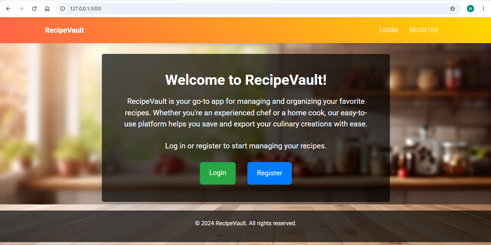
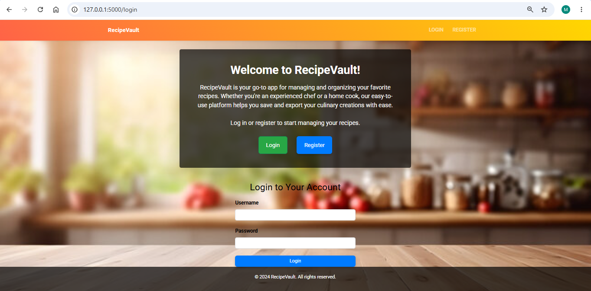
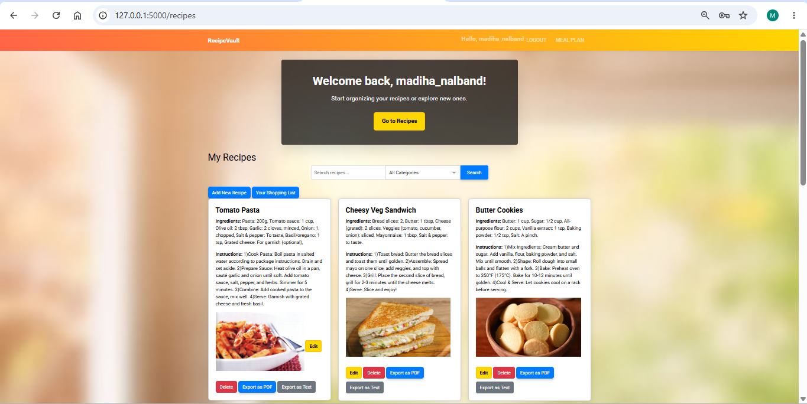
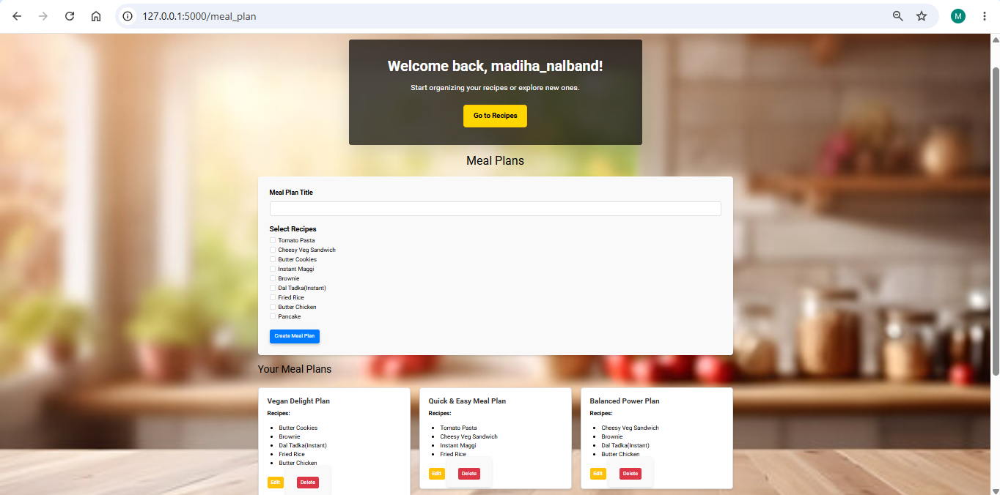
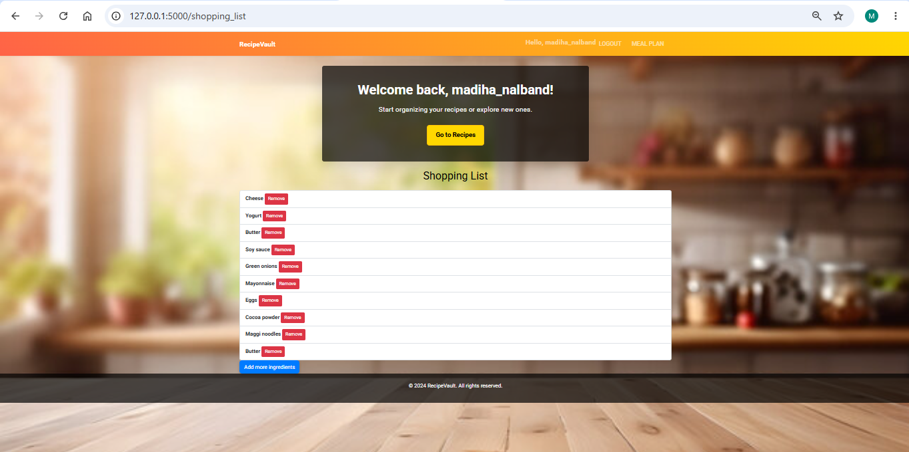

# 🍽️ RecipeVault


RecipeVault is a feature-rich web application built using **Flask** that helps users organize recipes, create meal plans, manage shopping lists, and export recipes as PDF documents.

The application provides secure user authentication, personalized recipe collections, image uploads, and a clean user interface to simplify everyday meal organization.

---

# 🎥 Project Demonstration

Watch the complete project here:

https://youtu.be/IUqcwyCLf-E?si=YHyvPaepn3qsQUhh

---

# 📸 Screenshots

### Home Page



### Login Page



### Recipe List



### Meal Planner



### Shopping List



---

# ✨ Features

## 👤 User Authentication

- User Registration
- Secure Login & Logout
- Password Hashing using Flask-Login

---

## 🍲 Recipe Management

- Add Recipes
- Edit Recipes
- Delete Recipes
- Categorize Recipes
- Search Recipes
- Filter Recipes
- Upload Recipe Images

---

## 📅 Meal Planner

- Create Meal Plans
- Associate Recipes with Meal Plans
- Edit Meal Plans
- Delete Meal Plans

---

## 🛒 Shopping List

- Add Ingredients
- Remove Ingredients
- Organize Grocery Items

---

## 📄 Export Options

- Export Recipes as PDF
- Export Recipes as Plain Text

---

## 🎨 User Interface

- Responsive Design
- Simple Navigation
- Clean Layout

---

# 🛠️ Tech Stack

## Frontend

- HTML5
- CSS3
- JavaScript
- Jinja2 Templates

## Backend

- Python
- Flask

## Database

- SQLite
- SQLAlchemy ORM

## Additional Libraries

- Flask-Login
- Flask-Migrate
- Werkzeug
- WeasyPrint
- Alembic

---

# 📂 Project Structure

```text
RecipeVault/
│
├── _pycache_/
├── instance/
├── migrations/
|
├── static/
│   ├── css/
│   ├── images/
│   ├── js/
│   └── uploads/
│
├── templates/
│
├── app.py
├── alembic.ini
├── requirements.txt
└── README.md
```

---

# 🚀 Installation

## Clone the repository

```bash
git clone https://github.com/MadihaNalband/recipevault-flask.git
```

```bash
cd RecipeVault
```

## Install dependencies

```bash
pip install -r requirements.txt
```

## Configure Database

```bash
alembic upgrade head
```

## Run the application

```bash
python app.py
```

Open your browser and visit

```
http://127.0.0.1:5000
```

---

# 💡 Main Functionalities

✔ User Authentication

✔ Recipe Management

✔ Image Upload

✔ Meal Planning

✔ Shopping List

✔ PDF Export

✔ Search & Filtering

---

# 📚 Learning Outcomes

This project helped me gain practical experience with:

- Flask Application Development
- SQLAlchemy ORM
- Database Design
- CRUD Operations
- User Authentication
- Session Management
- File Upload Handling
- Database Migrations
- PDF Generation
- Template Rendering using Jinja2

---

# 🚀 Future Improvements

Some features planned for future versions include:

- Favorite Recipes
- AI Recipe Recommendations
- Nutritional Information
- Recipe Ratings & Reviews
- Email Verification
- Dark Mode
- Mobile App
- Cloud Storage Integration

---

# 👩‍💻 Author

**Madiha Nalband**

This project was developed as part of a CS50x certificate course to demonstrate full-stack web application development using Flask.

---

# 📄 License

This project is intended for educational purposes.


